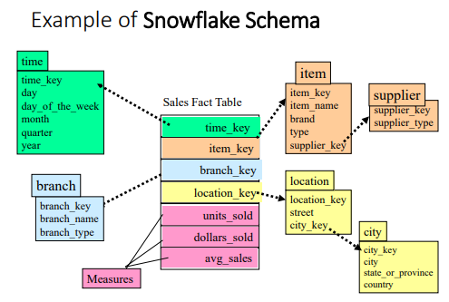
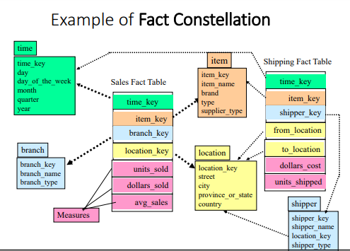
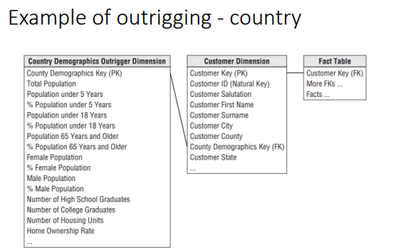

Steps to create a Data Mart

# Dimensional Model

## Components

- **FACT table**: Primary table where numeric performance measures for a business process are stored
  - Composite PK from many FKs
  - Facts/measures: A business measure (numeric, additive)
- **Dimensional tables**
  - contains textual description of business
  - many, many, many dimensional attributes
  - used to specify query constraints

# Designing an Individual Dimensional Model

## Step 1: Choose the Business Process to Model

- Almost always something to do with the "Sales" and/or "Productivity"
  - Retail
  - Healthcare
  - Insurance
  - Telecoms
- Motivated using \$\$\$\$ saved (or gained)

## Step 2: Declare the Gain

- Answer question: _"How do you describe a single row in the fact table"_
- General guiding principle:
  - we choose the _lowest meaningful (and feasible) grain_ of each dimension
- Why:
  - we want to see all those details
  - we can always aggregate (sum, count, average) later

## Step 3: Choose the Dimensions

- Answer question: "How does the business describe the data that results from the business process?"
- This is determined by grain of fact table
- add all possibly relevant dimensions and many, many descriptive attribute values

## Step 4: Choose the Facts/Measures

- Answer question: "What are we measuring?"
- Specific to grain of fact table
- Store additive values
- Percentages and ratios, also store numerator + denominator

# Types of Dimensions

- Causal: promotion, contract, deal
- Degenerate: ticket number, order number
- Status: account status, shipment status
- Audit: data quality and record lineage
- Junk: indicators and flags
- role-playing: one dimension acting in many "views" of the data

## Role-playing dimensions

- keys with different roles showing the same data
- you can implement a role-playing dimension using a SQL View

## Modelling multiple units of measure

To make sure there is no confusion, we have units of measure in the data schema design. For example if a product has a length field, then we also store a length-unit field.

We could also design our schema to store the length in all units of measure, so a length-cm field or length-inches.

## Modelling multiple currencies

We keep a local currency price as well as a field for equivalent currencies in our schema.

### When do we measure the conversation rate?

We convert the local currency based on where the data mart is located. We would use the data mart's local time.

## Modelling many-to-many Dimensions

- 0, 1 M: exact number unknown before creating dimensional model
- use a bridge entity
- useful for easy querying
- dimensional model won't be a star anymore
- use with caution
- implemented during data staging

## Monster Dimension

A monster dimension changes frequently, leading to an excessive number of rows.

Use banding as a solution. Think of banding like a range. Leads to better analytics and better data mining, both occur sometimes.

## Slowly changing dimension

Let some fields be overwritten if incorrect data is inputted.

# Alternative Designs

## Stars vs Snowflakes

- snowflaking happens when we choose to normalise a dimension.
- the golden rule: avoid as far as possible.
- why? recall cost of joining tables

## Galaxies or Fact Constellations

These are data marts share dimensions.

### Implementation issues

- conformed dimensions
- conformed measures
- conformed: exactly the same, or a rollup / drill down

- aim: avoid stovepipes
- golden rule: when we aggregate (sum or count), we get the same totals

# Fact constellations revisited

Galaxies data integration issues

- conflicting dimensional attribute meaning
- conflicting measure meaning
- our aim conformed, exactly the same or a rollup (concept hierarchies)
- golden rule:
  - when we aggregate, we get the same dimensions

## Conformed dimensions

- Attributes in separate dimensional tables (associated with different have same names and domains)
- Goal: Analytic consistency
- Same key values, same data definitions, same attribute values

### Productivity

Problem: conflicts during data integration

Dimensions should match exactly between two sources

Approach: find common ground - (intersection)

### Granularity

Conflicts during data integration, missing details

Solution: add more detail, refine granularity

## Conformed measures

Technical definition should be exactly the same, if they are going to be compared or aggregated

# Handling multiple grains

Demographic data is aggregated data used to describe a population

- used for customer segmentation
- use Outrigging for low cardinality attributes
- Why? different grain, different load cycles avoid monster dimensions

## Outrigging

## Downwards allocation

When you have multiple grains the general idea is to allocate line items using a standard approach

# Modeling mistakes

Don'ts:

1. Place text attributes in the Fact table
2. Limit verbose descriptions to save space
3. Avoid snowflaking. Normalize to save space (leads to slower queries)
4. Ignoring the need to track changes
5. Add new hardware to solve all query performance issues
6. Use operational keys as primary keys
7. Neglect to declare and comply with grain
8. Neglect a detailed design
9. Expect users to query normalized data
10. Fail to conform Facts and Dimensions
