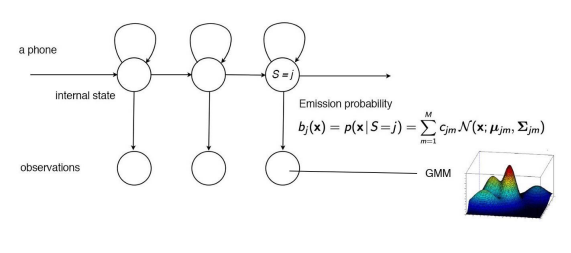

# Human Voice

## Voice Production

In humans, the sound is produced by the larynx which is also known as the the voice box.

### Source Filter Theory

## Types of sounds

### Voiced and Voiceless sounds

/b/ is an example of voiced, you feel the vibration
/th/ is an example of voiceless, no vibration

Sound wave frequencies, fundamental frequency of 125 Hz for men and 210 Hz for women.

## Pronunciation

For pronunciation, we split a word into syllable(s). A syllable usually contains one vowel sound, with or without surrounding consonants.

Consonants are sounds that are articulated with a complete or partial closure of the vocal tract. It can be voiced or voiceless.

Vowels are voiced sounds.

## Graphemes / Phonemes

Not a one-to-one relation between written words and phones.

Some graphemes are associated to multiple phonemes.

## Phones

Phones are the acoustic realization of phonemes.

The first half of the diagram is the audio for the fricative consonant /sh/. It is clearly different from the vowel after it.

Speech recognition also classifies some acoustic signals.

# Feature Extraction

## Sampling

In signal processing, sampling is the reduction of a continuous-time signal to a discrete-time signal.

Speech signals can usually be sampled at a much lower rate. For most phonemes, almost all of the energy is contained in the 100 Hz-4 kHz range, allowing a sampling rate of 8 kHz.

## Analyzing the sound wave

In speech recognition, we want to go from time domain to frequency domain. We apply the Fourier transformation for this.

## Spectrograms

We can use spectrograms to see the frequency energy distribution of vowels and different phones.

## MFCC

Mel-Frequency Cepstrum Coefficients

### Mel Scale

Perceptually relevant scale - closer to human's perception. Tries to represent how humans perceive frequencies.

### Cepstrum Coefficients

Use spectral envelope to find formants which carry identity of sound, or vocal tract frequency responses.

MFCC uses discrete cosine transform instead of fourier transform to obtain the coefficients.

### Steps

1. Waveform, Time domain
2. DFT, Frequency domain - obtain spectrograms
3. Log-Amplitude Spectrum, Log of Power - Decibles - less variation between high and low energy
4. Mel-Scaling - Perceptually relevant scaling on frequencies
5. Discrete Cosine Transform - Extraction of spectral envelop to create a Cepstrum
6. MFCCs - Take first 12 coefficients (slower variations)

39 features = 39 MFCCs per frame

12 parameters are related to the amplitude of frequencies.
1 parameter is the energy of the signal.
13 more for derivatives.
13 more for second derivatives.

Features used in:

- Speech recognition
- Mood classification (sentiment analysis)
- Music genre classification

# Acoustic-phonetic model

We capture pronunciation lexicons using hidden markov models. We have states for each phonemes, and we try to predict using a probabilistic model the acoustic signals.

In speech recognition, we have collected corpora which are phonetically transcribed and time-aligned.
(the start and the end time of each phone are marked.) TIMIT is one popular corpus that contains
utterances from 630 North American speakers.

## Gaussian Mixture Model (GMM)

Single gaussian is too simplistic and does not capture enough variations.
There would be a mixture model for each dimension, for each phoneme.

In summary here is an overview of the Acoustic-Phonetic model:

# Traditional ASR

## Architecture of traditional automatic speech recognition

## Training and Testing

Generative model:

Training a bigram model:

Estimating the probability of each word:

This is known as the Viterbi algorithm. It tries to find the most likely path for a word.
