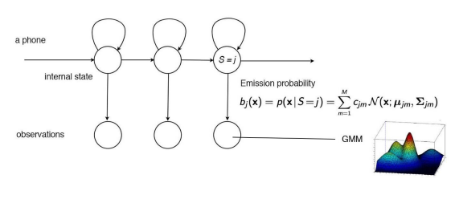
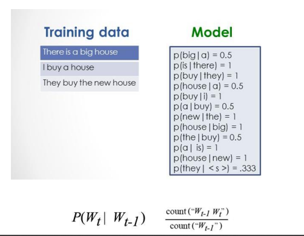
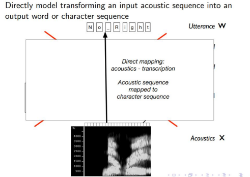

<link
  rel="stylesheet"
  href="https://cdn.jsdelivr.net/npm/katex@0.11.0/dist/katex.min.css"
  integrity="sha384-BdGj8xC2eZkQaxoQ8nSLefg4AV4/AwB3Fj+8SUSo7pnKP6Eoy18liIKTPn9oBYNG"
  crossOrigin="anonymous"
/>

# Human Voice

## Voice Production

In humans, the sound is produced by the larynx which is also known as the the voice box.

### Source Filter Theory


## Types of sounds

### Voiced and Voiceless sounds

/b/ is an example of voiced, you feel the vibration
/th/ is an example of voiceless, no vibration

Sound wave frequencies, fundamental frequency of 125 Hz for men and 210 Hz for women.

## Pronunciation

For pronunciation, we split a word into syllable(s). A syllable usually contains one vowel sound, with or without surrounding consonants.

Consonants are sounds that are articulated with a complete or partial closure of the vocal tract. It can be voiced or voiceless.

Vowels are voiced sounds.

## Graphemes / Phonemes

Not a one-to-one relation between written words and phones.

Some graphemes are associated to multiple phonemes.

## Phones

Phones are the acoustic realization of phonemes.

The first half of the diagram is the audio for the fricative consonant /sh/. It is clearly different from the vowel after it.

Speech recognition also classifies some acoustic signals.

# Feature Extraction

## Sampling

In signal processing, sampling is the reduction of a continuous-time signal to a discrete-time signal.

Speech signals can usually be sampled at a much lower rate. For most phonemes, almost all of the energy is contained in the 100 Hz-4 kHz range, allowing a sampling rate of 8 kHz.


## Analyzing the sound wave

In speech recognition, we want to go from time domain to frequency domain. We apply the Fourier transformation for this.


## Spectrograms

We can use spectrograms to see the frequency energy distribution of vowels and different phones.

## MFCC

Mel-Frequency Cepstrum Coefficients

### Mel Scale

Perceptually relevant scale - closer to human's perception. Tries to represent how humans perceive frequencies.

### Cepstrum Coefficients

Use spectral envelope to find formants which carry identity of sound, or vocal tract frequency responses.

MFCC uses discrete cosine transform instead of fourier transform to obtain the coefficients.

### Steps

1. Waveform, Time domain
2. DFT, Frequency domain - obtain spectrograms
3. Log-Amplitude Spectrum, Log of Power - Decibles - less variation between high and low energy
4. Mel-Scaling - Perceptually relevant scaling on frequencies
5. Discrete Cosine Transform - Extraction of spectral envelop to create a Cepstrum
6. MFCCs - Take first 12 coefficients (slower variations)

39 features = 39 MFCCs per frame

12 parameters are related to the amplitude of frequencies.
1 parameter is the energy of the signal.
13 more for derivatives.
13 more for second derivatives.

Features used in:

- Speech recognition
- Mood classification (sentiment analysis)
- Music genre classification

# Acoustic-phonetic model


We capture pronunciation lexicons using hidden markov models. We have states for each phonemes, and we try to predict using a probabilistic model the acoustic signals.

In speech recognition, we have collected corpora which are phonetically transcribed and time-aligned.
(the start and the end time of each phone are marked.) TIMIT is one popular corpus that contains
utterances from 630 North American speakers.

## Gaussian Mixture Model (GMM)

Single gaussian is too simplistic and does not capture enough variations.
There would be a mixture model for each dimension, for each phoneme.


In summary here is an overview of the Acoustic-Phonetic model:



# Traditional ASR

## Architecture of traditional automatic speech recognition


## Training and Testing


Generative model:


Training a bigram model:



Estimating the probability of each word:


This is known as the Viterbi algorithm. It tries to find the most likely path for a word.

# Neural Network End-to-End Models



# Evaluation

## Output Examples

**Target:** To illustrate the point a prominent middle east analist in washington recounts a call from one campaign

**Output:** Two alstrait the point a prominent midille east analyst im washington recouncacall from one campaign

**Target:** T.W.A. also plans to hang its boutique shingle in airports at Lambert Saint

**Output:** T.W.A. also plans tohing its bootik single in airports at Lambert Saint

**Target:** All the equity raising in Milan gave that stock market indigestion last year

**Output:** All the equity raison in Mulong gave the that stackr market in to justian last
year

## Word Error Rate

$WER = \frac{S+D+I}{N}$

where:

- $S$, substitutions
- $I$, insertions
- $D$, deletions
- $N$, number of words in the reference

## Evaluation Strategy

1. Choose a test sample
2. Create reference transcripts
3. Run a test
4. Create ASR hypothesis transcripts
5. Calculate WER
6. Make an assessment

Attention to results provided. WER does not tell you what caused the problems ... and might be very OPTIMISTIC.

> Were those results obtained in conditions that match YOUR intended use?

- Speaker
  - Who is speaking?
  - Which languages?
- Utterance
  - Text reading (continuous) or Spontaneous
- Discourse Content
  - Commands?
  - Specific domain?
- Environment
  - Noise conditions
  - Channel (microphone, phone)

# Deep Learning

Many components make up a complete speech application:

- speech transcription
- word spotting / trigger word
- speaker identification / verification

## Traditional ASR

Traditional ASR components:

- audio wave
- feature representation
- decoder

  - acoustic model
  - language model
  - pronunciation model

- Traditional pipeline is highly tweak-able, but
  also hard to get working well.
- Historically, each part of system has own set
  of challenges.
  - E.g., choosing feature representation.

## DL speech pipeline walkthrough

Starter code: [github.com/baidu-research/ba-dls-deepspeech](github.com/baidu-research/ba-dls-deepspeech)

### Preprocessing

Raw audio can be broken down into a 1D vector.

Two ways to start:

- minimally pre-process (simple spectrogram)
- Train model from raw audio wave

#### Spectrograms

- Take a small window (e.g. 20 ms) of Waveform
  - compute FFT and take magnitude
  - describes frequency content in local window
- concatenate frames from adjacent windows to form "spectrogram"

#### Acoustic Model

Goal: create a neural network (DNN/RNN) from which we can extract transcription, y.

- Train from labeled (x,y\*)

Main issue: length (x) != length(y)

- Don't know how symbols in y map to frames of audio.

Multiple ways to resolve:

- use attention, sequence to sequence models
- use Connectionist Temporal Classification (CTC)

### CTC

Basic idea:

1. RNN output neurons $c$ encode distribution over symbols. Note length(c) == length(x)

- For phoneme-based model: $c \in {AA, AE, AX, ..., ER1,\mathrm{blank}}$
- - For grapheme-based model: $c \in {A, B, C, D, ..., Z,\mathrm{blank, space}}$

Output neurons define distribution over whole character sequences $c$ assuming independence: $P(c|x) \equiv \Pi^{N}_{i=1} P(c_i | x)$

2. Define a mapping $\beta (c) \Rightarrow y$

Given a specific character sequence $c$, squeeze out duplicates + blanks to yield transcription

3. Maximize likelihood of $y*$ under this model

Update network parameters $\theta$ to maximize likelihood of correct label $y*$

> $\theta* = \mathrm{arg max} \sigma_{i} \mathrm{log} \sigma_{c:\beta(c)=y^{*(i)}} P(c|x^{(i)})$

Use usual gradient descent methods to optimize.
Tune entire network with backpropagation.

### Training

Getting RNN to train well is tricky.

Two tricks:

- "SortaGrad": order utterances by length during first epoch
- Batch normalization

### Decoding & language models

Network outputs $P(c|x)$. How do we find most likely transcription from $P(y|x)$?

Using approximation is a bad solution, but a useful diagnostic to "eyeball" models.

No efficient solution in general. Resort to search!

#### Language models

Even with better decoding, CTC model tends to make spelling + linguistic errors.

$P(y|x)$ modeled directly from audio.

- but not enough audio data to learn complicated spelling and grammatical structure
- only supports small vocabulary
- for grapheme models: "Tchaikovsky" problem

Two solutions:

- fuse acoustic model with language model
- incorporate linguistic data
  - predict phonemes + pronunciation lexicon + LM

Possible to train language model from massive text corpora

- learn spelling + grammar
- greatly expand vocabulary
- elevate likely cases over unlikely cases

Standard approach: n-gram models

- simple n-gram models are common and well supported
- train easily from huge corpora
- quickly update to follow trends in traffic
- fast lookups inside decoding algorithms

Given a word-based LM of form \\\\\\\\\\\$P(w\\\\\\\\\\\_{t+1}|w\\\\\\\\\\\_{1:t}), optimize:
\\\\\\\\\\\$\mathrm{arg max} P(w|x)P(w)^{\alpha}[length(w)]^{\beta}\$

$P(w|x) = P(y|x)$ for characters that make up $w$.

$\alpha$ and $\beta$ are tunable parameters to govern weight of LM and bonus/penalty for each word.

Basic strategy, use beam search to maximize $\mathrm{arg max} P(w|x)P(w)^{\alpha}[length(w)]^{\beta}\$.

Start with set of candidate transcript prefixes, A={}.

<!-- prettier-ignore-start -->
```
For t=1..T:
  For each candidate in A, consider:
    1. Add blank: don't change prefix; update probability using AM
    2. Add space to prefix; update probability using LM
    3. Add a character to prefix; update probability using AM
    Add new candidates with updated probabilities to $A_{new}$.
  A := most probable prefixes in $A_{new}$
```
<!-- prettier-ignore-end -->

#### Rescoring

Another place to plug in DL algorithms:

- System usually produce N-best list.
- Use fancier models to "rescore" this list

## Scaling up

Transcribing speech data isn't cheap, but not prohibitive:

- roughly 50 cents to \$1 per minute

Typical speech benchmarks offer 100s to few 1000s of hours.

### Types of speech data

Application matters, we want to find data that matches our goals

- Styles of speech
  - read
  - conversational
  - spontaneous
  - command/control
- issues
  - Disfluency / stuttering
  - Noise
  - Mic quality / #channels
  - Far field
  - Reverb / echo
  - Lombard effect
  - Speaker accents
- applications
  - dictation
  - meeting transcription
  - call centers
  - device control
  - mobile texting
  - home/IoT/Cars

Read speech is inexpensive way to get more data, but isn't that effective.

### Augmentation

You can use a sound processor to simulate different environments and get different types of speech data.

Its easier to engineer data pipeline than to engineer recognition pipeline.

### Computation

Computation takes a lot of time and lots of computing power. Solution is to use more GPUs with data parallelism.

## Production

So far:

- train acoustic + languge models
- scale them up
