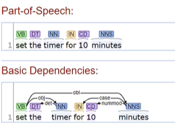

<link
  rel="stylesheet"
  href="https://cdn.jsdelivr.net/npm/katex@0.11.0/dist/katex.min.css"
  integrity="sha384-BdGj8xC2eZkQaxoQ8nSLefg4AV4/AwB3Fj+8SUSo7pnKP6Eoy18liIKTPn9oBYNG"
  crossOrigin="anonymous"
/>

# What is Intent Detection?

Intent detection is use text to detect an intent that can be used start an action.

# Language as Input

You can still capture intent regardless of language.

## Language variations

- Synonyms
  - two words that mean the same
- Near-synonyms
  - two words that nearly or almost mean the same
- Generic/specific
  - a word can have more specific names and vice versa a word can have more generic names
  - ex. restaurant <-> cafe, bistro, coffee shop
- paraphrases
  - sentences that can be said with multiple variations and have the same inherent meaning
- References
  - intent that needs to be done based on current scenario
  - "set an alarm six hours from now"
  - "what is a good thai restaurant on my way back from work?"
- Errors
  - Typographical
    - how to map words that have spelling errors
  - Transcription
    - how to map sentences that have grammatical errors (because the language model or acoustic model did not transcribe the speech correctly)
- Negation
  - negative intents
  - "set school alarm for 7am everyday but not on weekends"

# Language Representation

## Language unit of interest

- Document > Paragraph > Sentence > Word > Prefix/Suffix

## Lemmas

Lemmas take the root of words from sentences. For example: is -> be.

## Part-Of-Speech (POS)

What the type of a word is: verb, noun, preposition, etc.

## Named Entity Recognition

Recognize common names, companies (basically proper nouns) in sentences, and label the entity type (person, place, etc)

## Syntactic Analysis

gives the dependencies for parts of speech

## Word representation

Distributional Semantics

- Dense word representations which encapsulates their predictive nature of their context
- pre-trained (using larger corpora) and distributed

Newer representations such as BERT (Bidirectional Encoder Representation from Transformers), which provide a dense representation learned with (and triggered) a sentence.

# Intent Classification

## Steps

1. **Define the scope**:

- Making sure the domain specified and not too broad.
- All intents that are not planned are deemed out-of-scope.
- 

2. **What Languages will be supported?**
3. **Define a list of intents**
4. **Choose a methodolgy**

- Development
  - Availability of data
  - Development time
  - Team's expertise
- Production

  - System's expected response time
  - Adaptability

- **Template-based approach**

- Unsupervised (no training data required)
- Still…. Requires to come up with a few template per intention.
- Can always be used as a Baseline System.
- Quick (enough) to develop.

- **Supervised ML Approach**

- Gather LOTS of GOOD data
  - Balanced classes among all intents
  - Multiple speakers/writers
  - Spoken/Written sentences
  - Erroneous sentences (spoken/written)
- Existing packages (Python, other) allow quick enough development.
- Takes a long time to train (requires GPUs)
- Performance expectations: Train / Retrain, until… ?

# Slot Filling

- Build a slot filler recognizer (classifier) for each intent.
- Make sure the features used to help the classifier don't limit it too much
- Example: word in address book as feature
- Decide what to do on optional slots not filled
- Which default to use?
- Choice of what to do when a filler is not recognized (internal):
  - Assume it doesn't exist (apologize humbly)
  - Suggest something close
  - Example: Julianne, did you mean Julian?
  - Suggest to fix the issue
  - Example: Let's add Julianne in address book.
- Choice of what to do when a filler is not recognized (external):
  - Assume it doesn't exist (apologize humbly)
  - Suggest something close
  - Example: did you mean Brady Ho?
  - Suggest to fix the issue
  - Example: “you can subscribe to the paying version of X music to listen to ….”

## Approaches to slot filling

Values (slot filling)

- Accessibility to internal database
- Accessibility to external resources
- Accessibility to 3rd party providers

Internal database

- "Call Sarah"
- "Call Mom on speaker.“
- "Tell Lucy I am going to the store.“
- "Send email to John Doe about tomorrow and say Too busy to come.“

External Resources

- "What time is it in Tokyo?“
- "When is Labor Day?“
- “Turn on Bluetooth”
- “Where is the nearest hairdresser?”
- “Play music by Brad Meldhau.”
- "Check flight status of Air Canada 327”
- "What's the nearest museum?"

## Iterative slot filling

- We need to build a Focused Goal-Oriented Dialog
- Purpose: Fill all the slots to proceed to the « Action » (do what is requested)
- Hypothesis: Intent was correctly recognized!

- UI design (Conversational design)
  - Try not to annoy the user
  - When possible, give options
    - Will you drive, bike, take the train or take the bus?
  - Keep user on track

# Evaluation

## Task to evaluate

- Slot Filling
  - Check for errors when finding span and finding role
- Intent classifier
  - errors could occur during classification
  - wrong class
  - wrong classification binary intent/out-of-scope
  - wrong multi-class classification

## In vivo / In vitro

- in vitro refers to the lab setting
  - define metrics and benchmarks
- in vivo refers to in the real/wild
  - users satisfaction
- model could work amazingly in vitro but poorly in vivo or vice versa

### In Vitro Evaluation

Define benchmarks

- decide on task/subtask
- use (if possible) recognized datasets
- use recognized metrics

#### Metrics

- Intent classification

  - binary OOS/intent
  - multiclass classification

- precision/recall

  - per class
  - average over all classes

Depending on application, you decide what is valued more false-negatives or false-positives. Its hard to decide on this because you don't know what the user wants through in vitro testing

### In Vivo Evaluation

- Manage expectations
  - explain scope
- Limit frustration
  - limit false positive or false negative
- provide training to users
  - sentence to be spoken (help speech recognition)
  - provide request templates (typical sentences)
- have good communication skills

  - be apologetic
