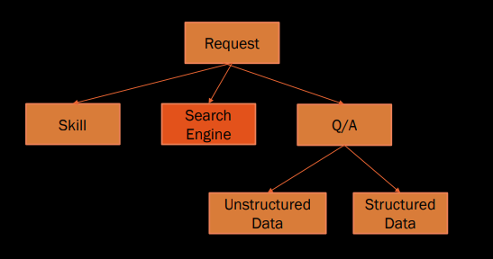
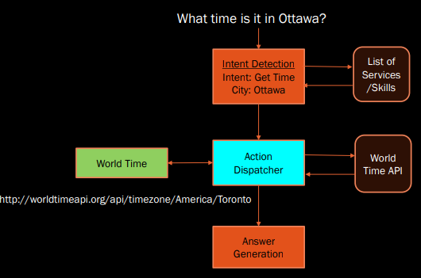
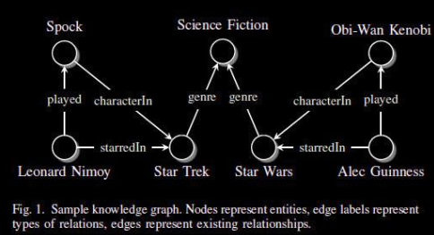
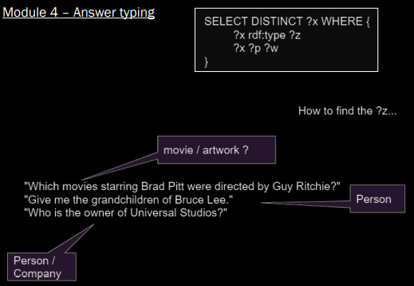

<link
  rel="stylesheet"
  href="https://cdn.jsdelivr.net/npm/katex@0.11.0/dist/katex.min.css"
  integrity="sha384-BdGj8xC2eZkQaxoQ8nSLefg4AV4/AwB3Fj+8SUSo7pnKP6Eoy18liIKTPn9oBYNG"
  crossOrigin="anonymous"
/>

# Problem Definition

Part of voice assistant that does the action, the act of fulfillment.

In some cases intent detection can also be joined to fulfillment / action.



# Exploring Service APIs

An **Action Dispatcher** calls a service based on a predefined list of services.



In the above example, Ottawa isn't recognized by the API, so we get the nearest applicable city.

# Question Types and Answer Types

## Question Types

Factoid question:

- Questions that ask about a fact.
- Who was the first man in space?

List questions:

- Questions that ask for a list answer
- Give me all cities in Germany

Yes/No questions:

- Was Margaret Thatcher a chemist?

Definition questions:

- Questions that ask for a definition
- Who was Tom Jobim?

Evaluative or comparative questions:

- asking about comparisons
- What is the difference between impressionism and expressionism?

Association questions:

- asking about the association of one thing to another
- What is the connection between Barack Obama and Indonesia?

Explanation/Justification questions:

- Why did the revenue of IBM drop?

Process questions:

- asking for some sort of methodology
- How do I make a cheesecake?

Opinion questions:

- What do most Americans think about gun control?

## Answer Typing

Answer should match to the type of question that is being asked.

Sometimes the answer could be a Person, Place or Thing or for more complex questions usually a descriptive text is provided.

## Question Answering

Question answering systems differ with respect to the data source(s) they are able to process to derive an answer.

On the one hand side, they usually consume a specific type of data:

- Structured data, e.g. relational databases and linked data
- Semi-structured data, e.g. XML documents
- Unstructured data, e.g. text documents

Hybrid question answering systems are able to process a combination of two or more of the types of data mentioned above.

# Questions Answering on Text Data

## Question Answering

When working on unstructured data (text-based), QA is often seen as an hybrid between Information Retrieval, and NLP.

IR focuses on Document Retrieval.

QA tries to actually answer a question, by finding a text passage that contains the answer.

Two categories of QA:
• Open-domain QA
• Text comprehension QA

## Open Domain QA

Examples:

- What are some ways to encourage oneself to step out of their comfort zone?
- What kind of books do you enjoy reading the most?
- How do I invest money into the stock market?
- What is actually a data science?
- Does tea contain caffeine?

Approach:

- Find the closest question
- this becomes a paraphrase finding problem

# QA on Structured Data

## Knowledge Graphs

A knowledge graph is a knowledge base that uses a graph-structured data model or topology to integrate data.



### Linked Open Data Cloud

Open source of a large knowledge graph, found [here](https://lod-cloud.net/).

## Triples

You can represent data in knowledge graphs as triples.

For example the earlier knowledge graph can be represented as:

- Leonard Nimoy, played, Spock
- Lenoard Nimoy, starredIn, Star Trek
- Spock, characterIn, Star Trek
- Star Trek, hasGenre, Science Fiction
- Star Wars, hasGenre, Science Fiction

## Baseline system

Various modules that could be useful in our system:

1. Entity search
2. Property search
3. Implicit properties - noun compounds
4. Answer typing
5. SPARQL templates
6. Use of filters

### Module 1 - Entity Search

"Which movies starring Brad Pitt were directed by Guy Ritchie?"
"Give me the grandchildren of Bruce Lee."
"Who is the owner of Universal Studios?"

### Module 2 - Explicit property search

"Which movies starring Brad Pitt were directed by Guy Ritchie?"
"Give me the grandchildren of Bruce Lee."
"Who is the owner of Universal Studios?

### Module 3 - Implicit property search / Noun compounds


### Module 4 - Answer typing



### Module 5 - Template selection

```SPARQL
SELECT DISTINCT ?x WHERE {
  ?x rdf:type ?z
  ?x ?p ?w
}
```

### Module 6 - SPARQL filters

How to know that we need filters (ORDER, COUNT, etc)
and what information are they typically on?

Examples:

- "Show me all basketball players that are higher than 2 meters."
- "Which volcanos in Japan erupted since 2000?"
- "Which companies have more than 1 million employees?"
