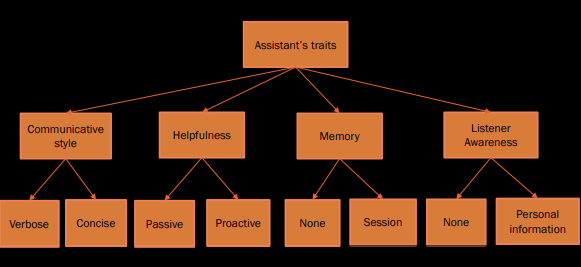
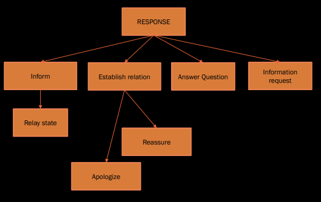
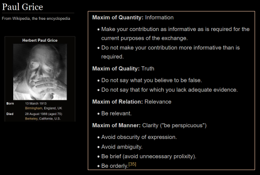
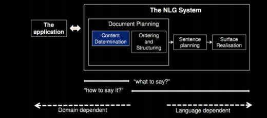
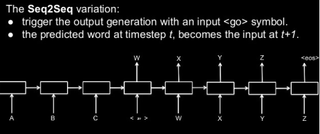
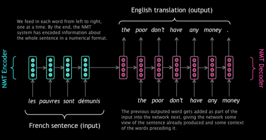

<link
  rel="stylesheet"
  href="https://cdn.jsdelivr.net/npm/katex@0.11.0/dist/katex.min.css"
  integrity="sha384-BdGj8xC2eZkQaxoQ8nSLefg4AV4/AwB3Fj+8SUSo7pnKP6Eoy18liIKTPn9oBYNG"
  crossOrigin="anonymous"
/>

Response generation is how virtual assistants construct a response based on the request given.

A response in relation to action performed can look like this:

Some traits for a virtual assistant:

**Purpose for response**:

# VA or Chatbot

## Virtual Assistants

This is software that can assist people with basic tasks, usually using natural language. Intelligent personal assistants can go online and search for an answer to a user's question. Either text or voice can trigger an action.

## Chatbots

Text is the main way to get assistance from a chatbot.
Chatbots can simulate a conversation with a human user. Many
companies use them in the customer service sector to answer basic
questions and connect with a live person if necessary

# Conversational Design

8 principles:

- cooperative
  - Paul Grice believed that there's no conversation without
    cooperation. It means your chatbot can support a customer
    only if it cooperates and provides information the user is
    looking for.
- goal-oriented
  - 
- context-aware
  - Create personalized chatbot greetings. They'll pop up in
    various conditions, based on the time a user spends on a
    page, a page address, or a referring source.
  - You can create a different greeting for users who visit your
    website for the first time and for those who are recurring
    visitors.
  - Personalization boosts engagement and improves user
    experience.
- quick and clear
  - While creating your chatbot stories, try to avoid complex
    metaphors, idioms, and long ambiguous statements. They
    slow down the conversation and take users away from
    where they need to be.
  - Use simple language, don't ask a user to choose many things
    at once, and get to the point
- turn-based
- truthful
- polite
- error tolerant
  - To make your chatbot error-tolerant, try to anticipate
    common spelling mistakes first. Teach your chatbot these
    variations to improve its understanding

## Gricean's Maxims

# Text Generation from Structured Data

Applications of Natural Language Generation:

- Analysis of business intelligence dashboards
- Reporting on business data/data analysis
- IoT device status and maintenance reporting
- Individual client financial portfolio summaries and updates
- Personalized customer communication

## Stages of NLG process

1. Document planning

- content planning, document outline

2. Microplanning

- referring expressions, word choice, aggregation

3. Realisation

- converting specifications to a real text

## Current trend

Sequence-to-Sequence Models (SEQ2SEQ models)

# Evaluation

## NLG: Structure Data to Text

Input:

- Mona Lisa, is-in, Louvre

Output:

- Mona Lisa is located in le Louvre
- Le Louvre is home to the Mona Lisa
- The Mona Lisa can be found in Le Louvre
- Le Louvre contains the Mona Lisa

- Metrics (automatic evaluation)
  - Comparison between some references and the predictions
  - Zero-cost beyond the gathering of train-dev-test data
- Human evaluation
  - Analysis of predictions
  - Very costly
  - Requires InterAnnotator Agreement analysis as well

### Word-Based Metrics

- TER, BLEU, ROUGE, NIST, LEPOR, CIDER, METEOR
- Grammar-Based metrics
  - Readability
    - Word per sentence, syllables per sentence
  - Grammaticality
    - Mispellings, parsing score

### Human Evaluation

- Informativeness
  - Does the utterance provide all the useful information from the meaning representation?
- Naturalness
  - Could the utterance have been produced by a native speaker?
- Quality
  - How do you judge the overall quality of the utterance in terms of its grammatical correctness and fluency?

### Virtual Assistants

Virtual Assistant (or Conversational Agent)

- It's capacity (what it can do)
- It's perceived value by customers/users

- Engagement
  - How the user is interested in the conversation?
- Coherence
  - A coherent response indicates a comprehensible and relevant
    response to a user's request.
  - Measure number of incoherent responses/total utterances
- Domain Coverage
  - Coverage of agent within a domain
  - Goal-oriented (chatbots)
  - General domain (VAs) - average on different domains
- Conversational Depth
  - Number of turns that are possible (on same topic)
- Topical Diversity / Conversational Breadth
  - For general domain agents, how the agent is able to chat on various domains
